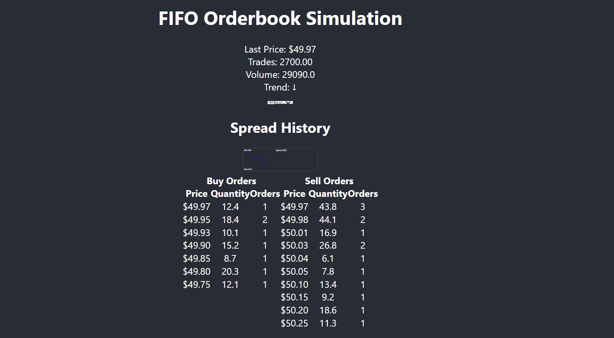

# Orderbook FIFO Simulation

A React-based FIFO orderbook simulation that generates buy and sell orders, executes trades using a FIFO matching engine, and displays real-time visualizations including order depth, spread history, and recent trades.

## Features

- **Real-Time Simulation:**  
  Generates and matches buy and sell orders in real time.

- **FIFO Order Matching:**  
  Orders are executed using first-in-first-out (FIFO) rules, simulating a real-world order book.

- **Visualizations:**  
  - **Spread History:** Displayed as a line graph with real-time min/max values.
  - **Combined Order Book:** Buy and sell orders are shown side by side.
  - **Recent Trades:** A log of trade executions with a formatted trade count (e.g., `1.00`, `19.00`).

## UI Preview

Below is a screenshot of the user interface:

## Installation

Since this repository includes only the core files (`src/App.js` and `src/Orderbook.js`), you can integrate them into a Create React App project.
